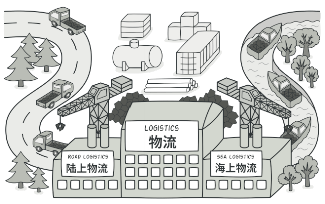
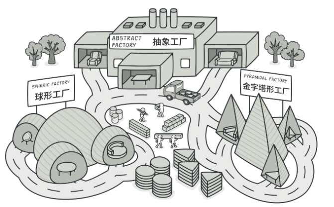
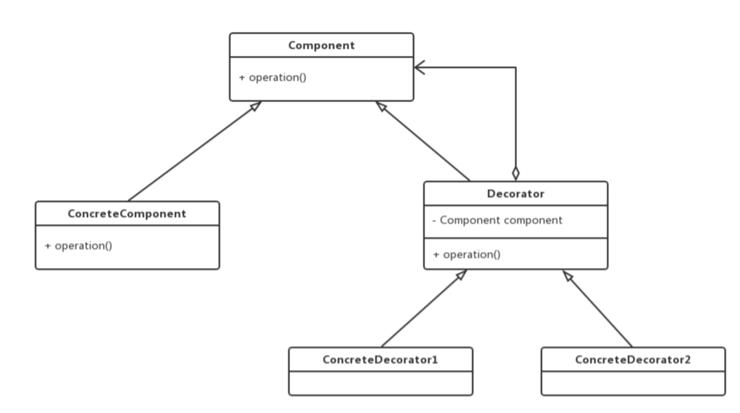
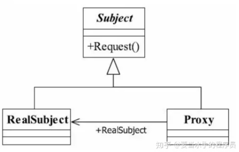

```
设计模式遵循六⼤原则；单⼀职责( ⼀个类和⽅法只做⼀件事 )、⾥⽒替换( 多态，⼦类可扩展⽗类 )、依赖
倒置( 细节依赖抽象，下层依赖上层 )、接⼝隔离( 建⽴单⼀接⼝ )、迪⽶特原则( 最少知道，降低耦合 )、开闭
原则( 抽象架构，扩展实现 )
```

- ####创建型

类型 | 实现要点
---|---
工厂模式  | 定义⼀个创建对象的接⼝，让其⼦类⾃⼰决定实例化哪⼀个⼯⼚类，⼯⼚模式使其创建过程延迟到⼦类进⾏
抽象工厂 | 提供⼀个创建⼀系列相关或相互依赖对象的接⼝，⽽⽆需指定它们具体的类
建造者  | 将⼀个复杂的构建与其表示相分离，使得同样的构建过程可以创建不同的表示
原型模式 | ⽤原型实例指定创建对象的种类，并且通过拷⻉这些原型创建新的对象
单例模式 | 保证⼀个类仅有⼀个实例，并提供⼀个访问它的全局访问点

- #### 结构型模式

类型 | 实现要点
---|---
适配器 | 将⼀个类的接⼝转换成客户希望的另外⼀个接⼝。适配器模式使得原本由于接⼝不兼容⽽不能⼀起⼯作的那些类可以⼀起⼯作
桥接模式 | 将抽象部分与实现部分分离，使它们都可以独⽴的变化。
组合模式 | 将对象组合成树形结构以表示"部分-整体"的层次结构。组合模式使得⽤户对单个对象和组合对象的使⽤具有⼀致性。
装饰模式 | 动态地给⼀个对象添加⼀些额外的职责。就增加功能来说，装饰器模式相⽐⽣成⼦类更为灵活。
外观模式 | 为⼦系统中的⼀组接⼝提供⼀个⼀致的界⾯，外观模式定义了⼀个⾼层接⼝，这个接⼝使得这⼀⼦系统更加容易使⽤。
享元模式 | 运⽤共享技术有效地⽀持⼤量细粒度的对象。
代理模式 | 为其他对象提供⼀种代理以控制对这个对象的访问。

- #### 行为模式

类型  | 实现要点
---|---
责任链 | 避免请求发送者与接收者耦合在⼀起，让多个对象都有可能接收请求，将这些对象连接成⼀条链，并且沿着这条链传递请求，直到有对象处理它为⽌。
命令 | 将⼀个请求封装成⼀个对象，从⽽使您可以⽤不同的请求对客户进⾏参数化
迭代器 | 提供⼀种⽅法顺序访问⼀个聚合对象中各个元素, ⽽⼜⽆须暴露该对象的内部表示
中介者 | ⽤⼀个中介对象来封装⼀系列的对象交互，中介者使各对象不需要显式地相互引⽤，从⽽使其耦合松散，⽽且可以独⽴地改变它们之间的交互。
备忘录 | 在不破坏封装性的前提下，捕获⼀个对象的内部状态，并在该对象之外保存这个状态。
观察者 | 定义对象间的⼀种⼀对多的依赖关系，当⼀个对象的状态发⽣改变时，所有依赖于它的对象都得到通知并被⾃动更新。
状态 | 允许对象在内部状态发⽣改变时改变它的⾏为，对象看起来好像修改了它的类。
策略 | 定义⼀系列的算法,把它们⼀个个封装起来,并且使它们可相互替换。
模板方法 | 定义⼀个操作中的算法的⻣架，⽽将⼀些步骤延迟到⼦类中。模板⽅法使得⼦类可以不改变⼀个算法的结构即可᯿定义该算法的某些特定步骤。
访问者 | 主要将数据结构与数据操作分离。

### 工厂模式-1

> ⼯⼚模式是⼀种创建型设计模式，其在⽗类中提供⼀个创建对象的⽅法， 允许⼦类决定实例化对象的类型, 它的主要意图是定义⼀个创建对象的接⼝，让其⼦类⾃⼰决定实例化哪⼀个⼯⼚类，⼯⼚模式使其创建过程延迟到⼦类进⾏。
> 
> 为了提供代码结构的扩展性，屏蔽每⼀个功能类中的具体实现逻辑。让外部可以更加简单的只是知道调⽤即可

#### 优点
> 避免创建者与具体的产品逻辑耦合、满⾜单⼀职责，每⼀个业务逻辑实现都在所属⾃⼰的类中完成 、 满⾜开闭原则，⽆需更改使⽤调⽤⽅就可以
在程序中引⼊新的产品类型

#### 缺点
>如有⾮常多的奖品类型，那么实现的⼦类会极速扩张。

### 抽象工厂-2

> 抽象⼯⼚模式与⼯⼚⽅法模式虽然主要意图都是为了解决，接⼝选择问题。但在实现上，抽象⼯⼚是⼀个中⼼⼯⼚，创建其他⼯⼚的模式。
#### 优点

- 降低耦合

> 抽象工厂模式将具体产品的创建延迟到具体工厂的子类中，这样将对象的创建封装起来，可以减少客户端与具体产品类之间的依赖，从而使系统耦合度低，这样更有利于后期的维护和扩展

- 符合开-闭原则

> 新增一种产品类时，只需要增加相应的具体产品类和相应的工厂子类即可

- 符合单一职责原则
> 每个具体工厂类只负责创建对应的产品

#### 缺点
> 抽象工厂模式很难支持新种类产品的变化。
这是因为抽象工厂接口中已经确定了可以被创建的产品集合，如果需要添加新产品，此时就必须去修改抽象工厂的接口，这样就涉及到抽象工厂类的以及所有子类的改变，这样也就违背了“开发——封闭”原则。

#### 单例-5
> 单例模式（Singleton）的目的是为了保证在一个进程中，某个类有且仅有一个实例

#### 适配器-6
> 适配器模式的主要作⽤就是把原本不兼容的接⼝，通过适配修改做到统⼀。使得⽤户⽅便使⽤，就像我
们提到的万能充、数据线、MAC笔记本的转换头、出国旅游买个插座等等，他们都是为了适配各种不同
的 ⼝ ，做的兼容。

#### 装饰器-9
> 动态地给一个对象添加一些额外的职责。就增加功能来说，相比生成子类更为灵活。
> 使⽤装饰器模式满⾜单⼀职责原则，你可以在⾃⼰的装饰类中完成功能逻辑的扩展，⽽不影响主
类，同时可以按需在运⾏时添加和删除这部分逻辑。


- 抽象组件角色(Component): 定义可以动态添加任务的对象的接口
- 具体组件角色(ConcreteComponent)：定义一个要被装饰器装饰的对象，即 Component 的具体实现
- 抽象装饰器(Decorator): 维护对组件对象和其子类组件的引用
- 具体装饰器角色(ConcreteDecorator)：向组件添加新的职责

#### 享元-11
> 运用共享技术有效地支持大量细粒度的对象。
> 如果一个对象实例一经创建就不可变，那么反复创建相同的实例就没有必要，直接向调用方返回一个共享的实例就行，这样即节省内存，又可以减少创建对象的过程，提高运行速度。

#### 代理-12
> 由于某些原因需要给某对象提供一个代理以控制对该对象的访问。这时，访问对象不适合或者不能直接引用目标对象，代理对象作为访问对象和目标对象之间的中介
> 为其他对象提供一种代理以控制对这个对象的访问。



> Subject是一个抽象类或者接口，RealSubject是实现方法类，具体的业务执行，Proxy则是RealSubject的代理，直接和client接触的。
代理模式可以在不修改被代理对象的基础上，通过扩展代理类，进行一些功能的附加与增强。

#### 观察者-18
> 又被称为发布-订阅（Publish/Subscribe）模式，它定义了一种一对多的依赖关系，让多个观察者对象同时监听某一个主题对象。这个主题对象在状态变化时，会通知所有的观察者对象，使他们能够自动更新自己

- Subject：抽象主题（抽象被观察者），抽象主题角色把所有观察者对象保存在一个集合里，每个主题都可以有任意数量的观察者，抽象主题提供一个接口，可以增加和删除观察者对象。
- ConcreteSubject：具体主题（具体被观察者），该角色将有关状态存入具体观察者对象，在具体主题的内部状态发生改变时，给所有注册过的观察者发送通知。
- Observer：抽象观察者，是观察者者的抽象类，它定义了一个更新接口，使得在得到主题更改通知时更新自己。
- ConcrereObserver：具体观察者，实现抽象观察者定义的更新接口，以便在得到主题更改通知时更新自身的状态。

